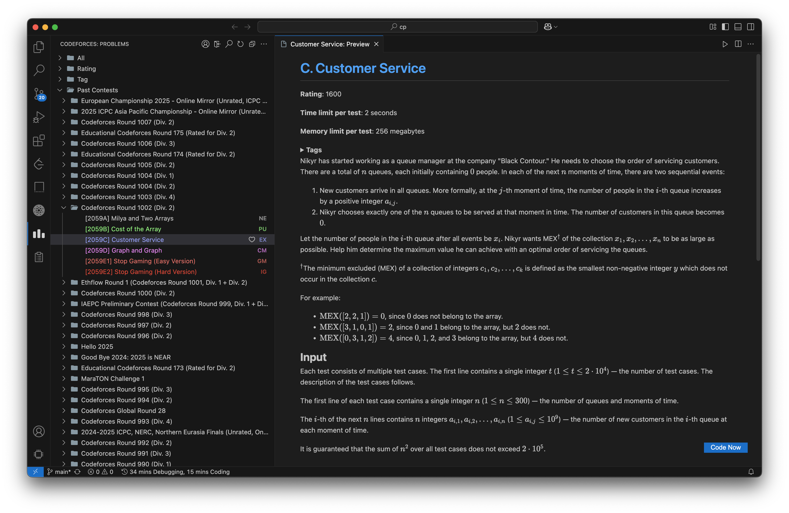
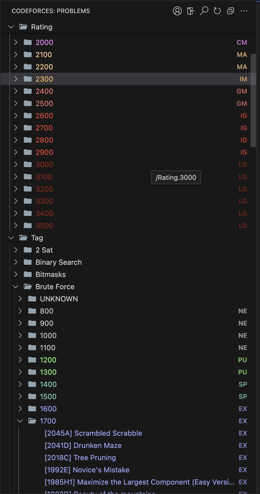
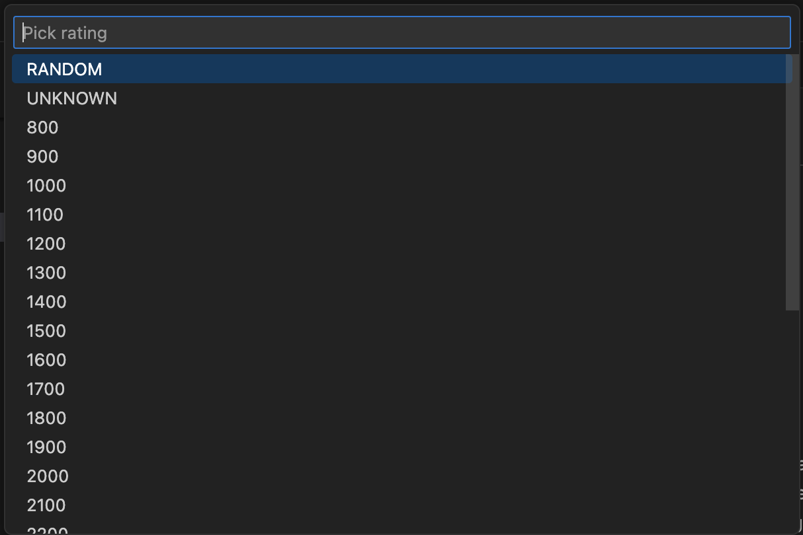
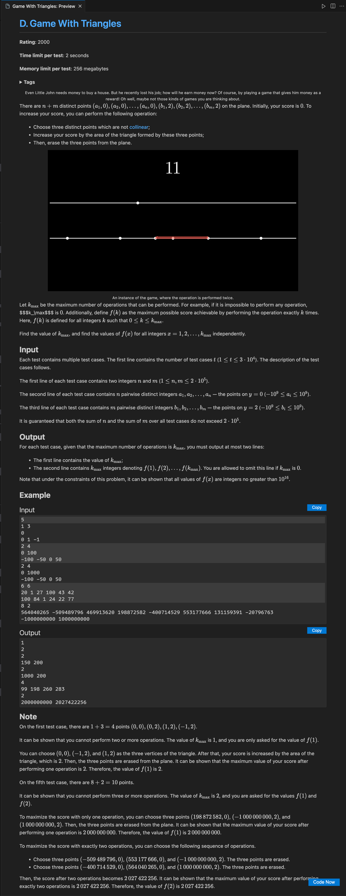
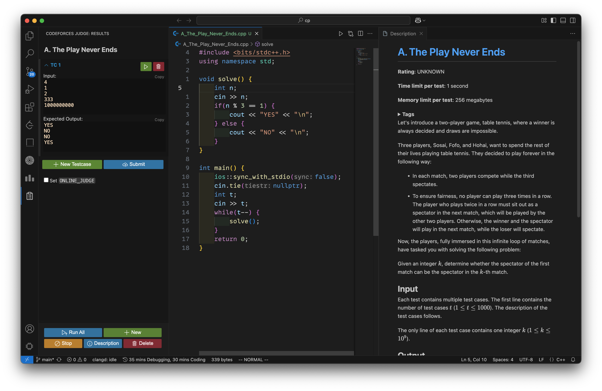
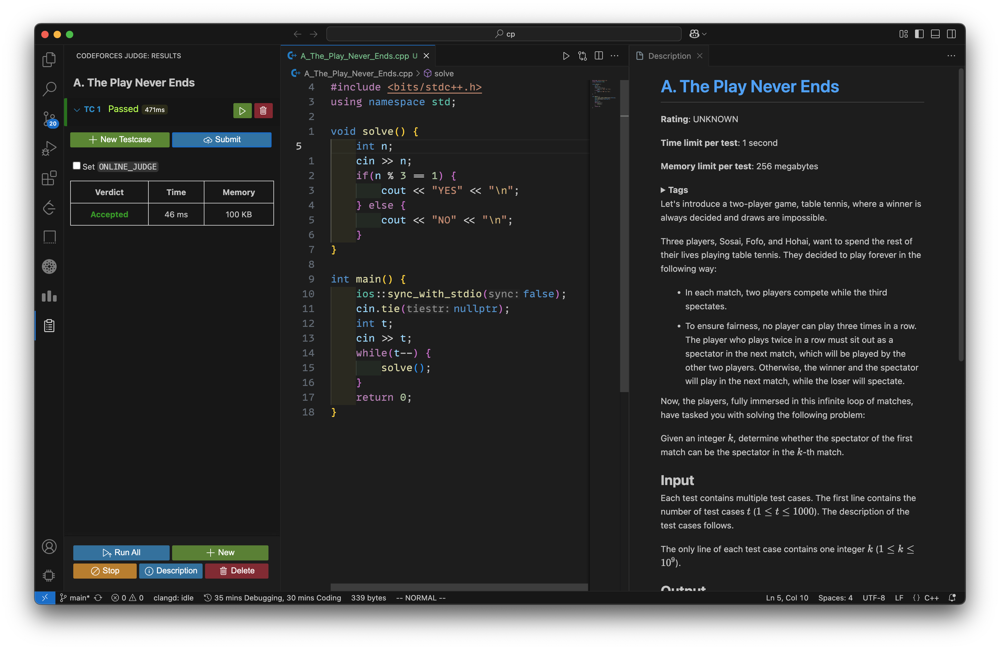

# Codeforces VS Code Extension

A powerful VS Code extension to practice and compete on Codeforces directly from VsCode editor.

## ✨ Features

✅ **List All Problems** – Browse all Codeforces problems within VS Code.  
✅ **Categorize Problems** – Filter by rating, tags, past contests, and ongoing contests.  
✅ **Pick a Random Problem** – Get a randomly selected problem based on rating.  
✅ **Handle Integration** – Add your Codeforces handle to track solved/unsolved problems.  
✅ **Sort Problems** – Order by contest, solved count (ascending/descending).  
✅ **Color-Coded Ratings** – Problems are colorized in the tree view based on difficulty.  
✅ **Preview Problem Statement** – Click on a problem to see its details inside VS Code.  
✅ **Test & Submit Directly** – Run test cases and submit solutions without leaving VS Code.  
✅ **Custom Test Cases** – Add and test with your own cases.  
✅ **Sign In/Sign Out** – Authenticate with Codeforces from the extension.  

## 📸 Screenshots

### 🌟 Problem List & Categorization

### 🎯 Random Problem Selection

### 📝 Problem Preview

### 🚀 Test, Submit and View Results Directly

## 🎬 Demo

## 🚀 Installation

1. Open **VS Code**.
2. Go to **Extensions** (`Ctrl + Shift + X`).
3. Search for **Codeforces VS Code Extension**.
4. Click **Install**.
5. Start solving problems directly in VS Code!

## 🛠️ Usage

- **Browse problems** from the sidebar.
- **Select categories/tags** to filter problems.
- **Click on a problem** to preview its statement.
- **Right-click & Pick a Random Problem** based on rating.
- **Sign in** to track your progress and submit directly.
- **Run tests & submit** your solution with one click.

## 🔗 Links

- [Marketplace](https://marketplace.visualstudio.com/items?itemName=codewithsathya.vscode-codeforces)
- [GitHub Repository](https://github.com/codewithsathya/vscode-codeforces)

## ❤️ Contribute

Contributions are welcome! Feel free to open issues or submit pull requests.

---

Enjoy competitive programming with Codeforces directly in VS Code! 🚀
